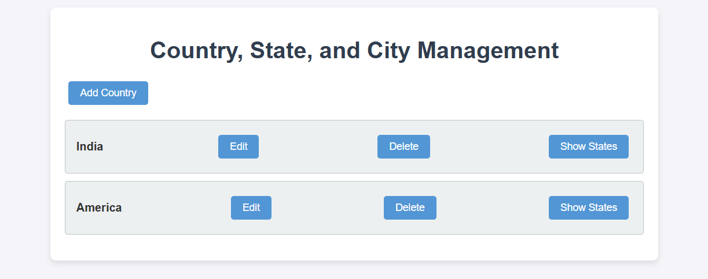
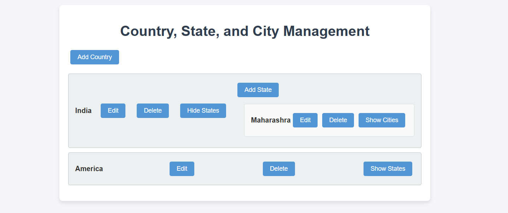
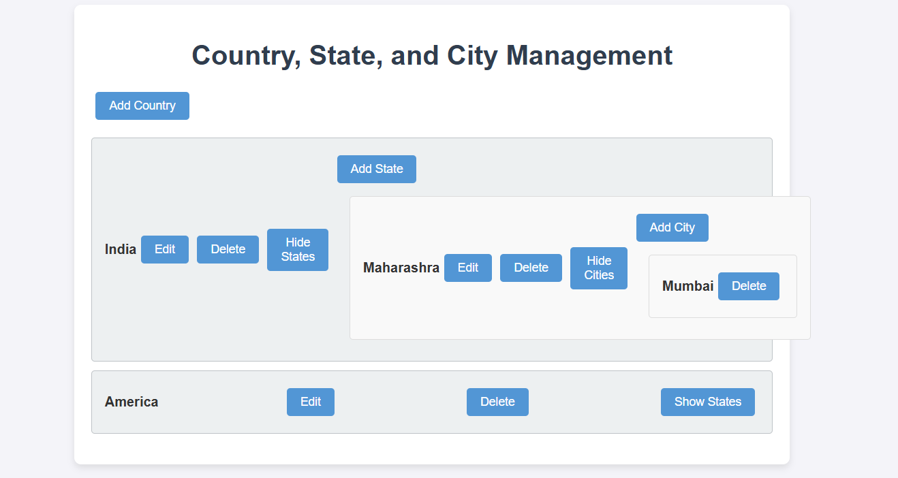

# Country, State, and City Management Application

A React-based application for managing countries, states, and cities in a hierarchical structure. This project allows users to add, edit, and delete countries, states, and cities with confirmation dialogs for critical actions.

---

## Features

1. **Country Management**:

   - Add a new country.
   - Edit the name of an existing country.
   - Delete a country (including all associated states and cities).

2. **State Management**:

   - Add a new state to a specific country.
   - Edit the name of an existing state.
   - Delete a state (including all associated cities).

3. **City Management**:

   - Add a new city to a specific state.
   - Delete a city.

4. **Confirmation Dialogs**:
   - Confirmation prompts for delete and edit actions to prevent accidental data loss.
  
5. **Deployment**:
   - The application is deployed on Netlify and can be accessed [here](https://country-state-and-city-management-app.netlify.app/)

---

## Technologies Used

- **ReactJS**: For building the component-based user interface.
- **JavaScript (ES6)**: For state management, event handling, and data manipulation.
- **CSS**: For styling the application.

---

## File Structure

```
country-state-city-app/
├── public/
│   └── index.html
├── src/
│   ├── components/
│   │   ├── CountryList.js
│   │   ├── StateList.js
│   │   └── CityList.js
│   ├── App.js
│   ├── index.js
│   └── styles.css
├── package.json
└── README.md
```

---

## Setup and Installation

1. **Clone the Repository**:

   ```bash
   git clone https://github.com/umar710/country-state-city-app.git
   cd country-state-city-app
   ```

2. **Install Dependencies**:

   ```bash
   npm install
   ```

3. **Run the Application**:

   ```bash
   npm start
   ```

4. **Open the Application**:
   - Open your browser and navigate to `http://localhost:3000`.

---

## How to Use

1. **Add a Country**:

   - Click the "Add Country" button.
   - Enter the name of the country in the prompt.

2. **Edit a Country**:

   - Click the "Edit" button next to the country you want to edit.
   - Enter the new name in the prompt.

3. **Delete a Country**:

   - Click the "Delete" button next to the country you want to delete.
   - Confirm the deletion in the confirmation dialog.

4. **Add a State**:

   - Click the "Show States" button for a specific country.
   - Click the "Add State" button.
   - Enter the name of the state in the prompt.

5. **Edit a State**:

   - Click the "Edit" button next to the state you want to edit.
   - Enter the new name in the prompt.

6. **Delete a State**:

   - Click the "Delete" button next to the state you want to delete.
   - Confirm the deletion in the confirmation dialog.

7. **Add a City**:

   - Click the "Show Cities" button for a specific state.
   - Click the "Add City" button.
   - Enter the name of the city in the prompt.

8. **Delete a City**:
   - Click the "Delete" button next to the city you want to delete.
   - Confirm the deletion in the confirmation dialog.

---

## Screenshots

### Main Screen



### State Management



### City Management



---

## Contributing

Contributions are welcome! If you'd like to contribute, please follow these steps:

1. Fork the repository.
2. Create a new branch (`git checkout -b feature/YourFeatureName`).
3. Commit your changes (`git commit -m 'Add some feature'`).
4. Push to the branch (`git push origin feature/YourFeatureName`).
5. Open a pull request.


## Acknowledgments

- This project was created as part of a ReactJS assignment.
- Special thanks to the ReactJS documentation for providing excellent resources.

---

## Contact

For any questions or feedback, feel free to reach out:

- **Umer Faruque Syed**
- **Email**: umarsyed082@gmail.com
- **GitHub**: [umar710](https://github.com/umar710)

```

```
